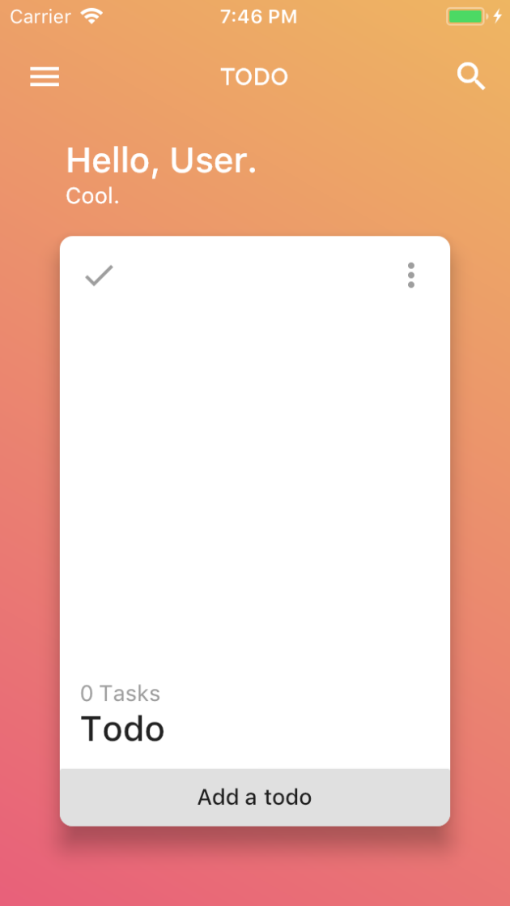

# To-do App in Flutter

A to-do app based on [group 9 iPhone X Todo App Concept](https://www.uplabs.com/posts/iphone-x-todo-concept)

Current preview: 

Jae-seong Jeong's Concept| Actual App - iOS | Actual App - Android
:---: | :---: | :---:
| WIP | WIP

Created for learning purposes.

Resources used:
* [flutter.io: Building Layouts in Flutter](https://flutter.io/tutorials/layout/)
* [iampawan/Flutter-UI-Kit](https://github.com/iampawan/Flutter-UI-Kit)
* [Sergi & Replace: Planets-Flutter: from design to app](https://sergiandreplace.com/planets-flutter-from-design-to-app/)
* [hackernoon: Scaleable app structure in Flutter](https://hackernoon.com/scalable-app-structure-in-flutter-dad61a4bc389)
* [Dart: Effective Dart: Style](https://www.dartlang.org/guides/language/effective-dart/style#do-name-import-prefixes-using-lowercase_with_underscores)
* [Build reactive mobile apps with Flutter (Google I/O '18)](https://www.youtube.com/watch?v=RS36gBEp8OI)
* [Build Native Mobile Apps with Flutter | Udacity](https://www.udacity.com/course/build-native-mobile-apps-with-flutter--ud905)
* [Flutter Login Animation](https://blog.geekyants.com/flutter-login-animation-ab3e6ed4bd19)
* [MD101 Flutter Codelabs](https://codelabs.developers.google.com/codelabs/mdc-101-flutter/#0)

## Getting Started

For help getting started with Flutter, view our online
[documentation](https://flutter.io/).
